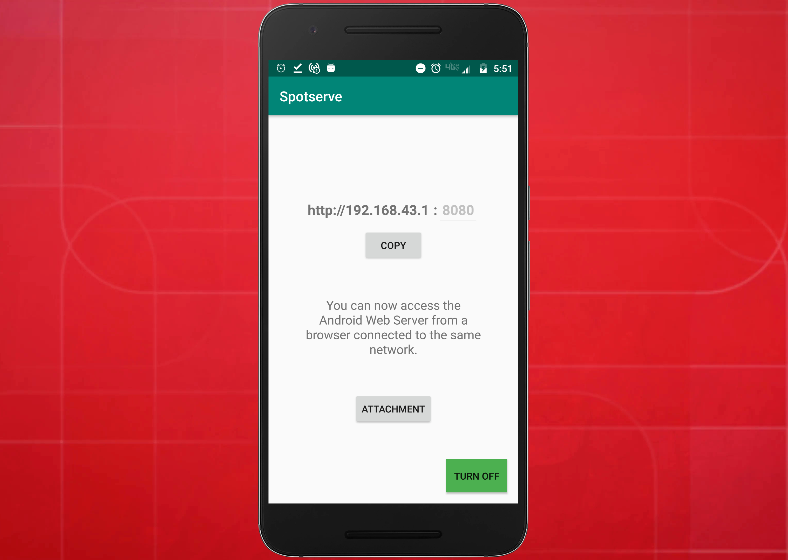
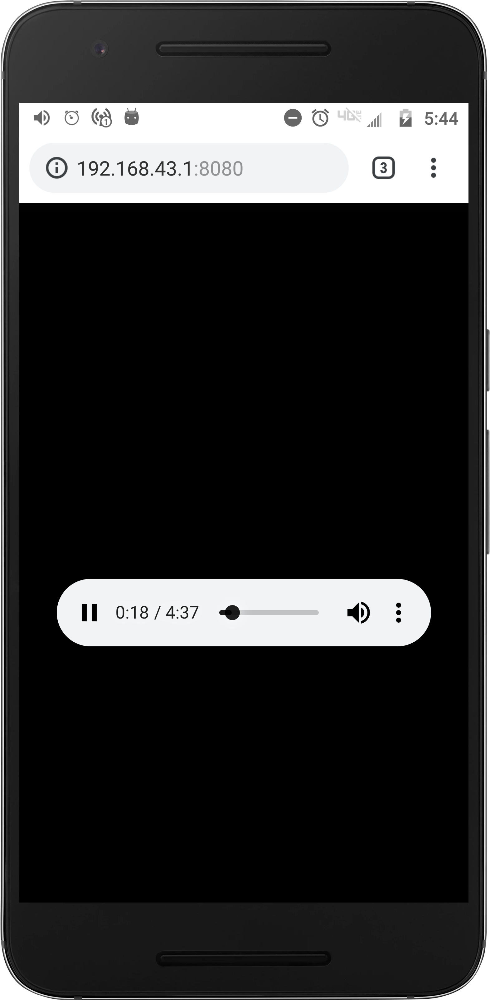
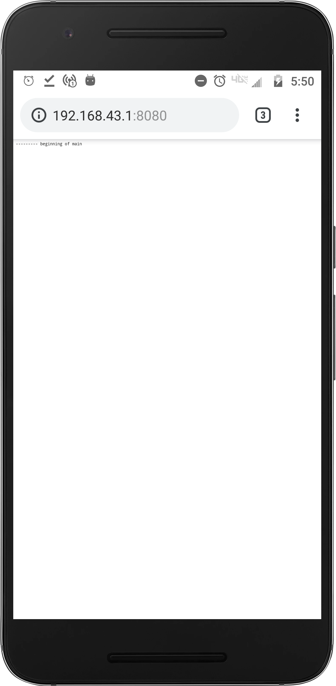
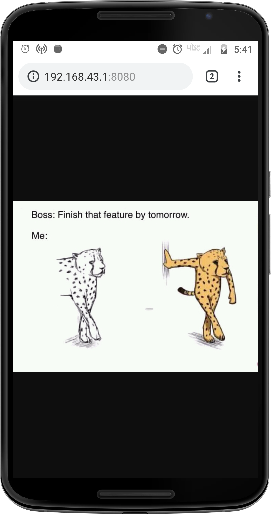
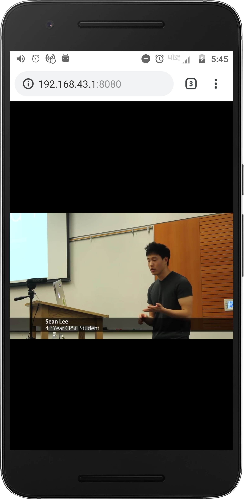

# Spotserve
Android web server demo using NanoHTTPD through wifi hotspot/wifi network.

### Hosting the server:
You can host the web server on your android device by following one of the following two ways:

**Choice 1**

* Connect your server device to a wifi network.
* Client devices connected to the same wifi network, will be able to access the server.

**Choice 2**

* Turn on the hotspot on your server device.
* This way, the server will be hosted using the ip address of your server device's wireless access point. 
* Client devices can then access the web server by connecting to your server device's hotspot.

### Supported extensions
Using this server, you can upload files of different mime types. Currently tested ones are mp3, mp4, pdf, txt, jpg, png, etc.

  
   

  
   

### Tested Android Versions:
So far, we've got SpotServe tested on:
* **9** (Asus Zenfone Max M1 Pro)
* **8.0** (Moto G4)
* **8.1.0**(Oppo A3S)
* **6.0.1** (Motorola Droid Turbo)
* **5.1.1** (Oppo a37f)

