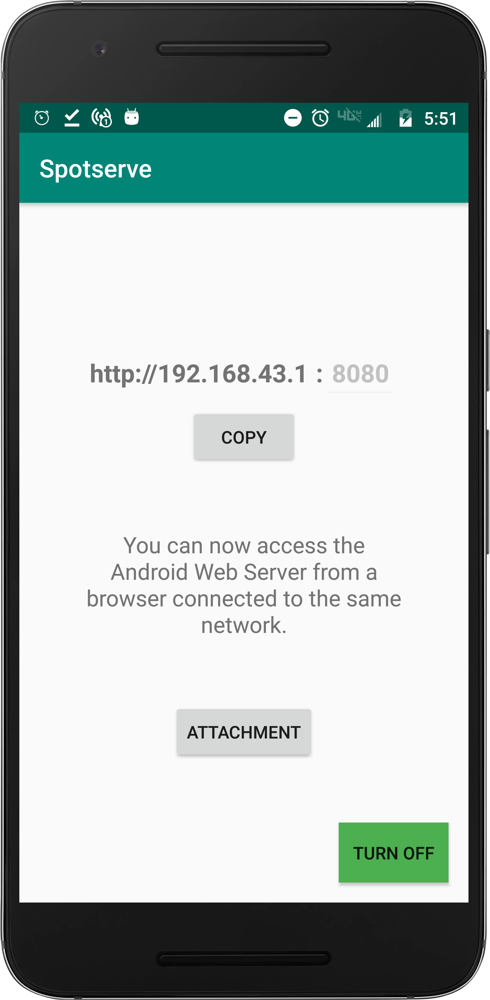

# Spotserve
Android web server using NanoHTTPD through wifi hotspot/wifi network.

### Hosting the server:
You can host the web server on your android device by:
1. Connecting to a wifi network.
2. Using the ip address of your wireless access point i.e. wifi hotspot. Have a look at this screenshot.

### Supported extensions
Using this server, you can upload files of different mime types. Currently tested ones are mp3, mp4, pdf, txt, jpg, png, etc.

  
   

  
   

